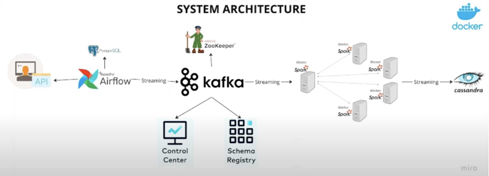

## Project Overview
This project demonstrates an end-to-end data engineering pipeline for real-time data streaming using Apache Kafka and Apache Spark. It covers data ingestion, processing, and visualization, showcasing the integration of these powerful technologies.



## Features
- **Data Ingestion**: Set up Apache Kafka for real-time data streaming.
- **Stream Processing**: Use Apache Spark for processing the streamed data.
- **Data Visualization**: Create real-time dashboards to visualize the processed data.

## Technologies Used
- Apache Kafka
- Apache Spark


### Components in the System Architecture:

1. **API**
   - **Description**: The API allows users to interact with the system by sending requests and receiving responses.
   - **Role**: Acts as the entry point for user inputs and system outputs.

2. **Apache Airflow**
   - **Description**: A platform to programmatically author, schedule, and monitor workflows.
   - **Role**: Manages the workflow and ensures the data is processed and moved as needed.

3. **PostgreSQL**
   - **Description**: An open-source relational database management system.
   - **Role**: Stores structured data that can be accessed and managed by Apache Airflow.

4. **Apache Kafka**
   - **Description**: A distributed event streaming platform.
   - **Role**: Facilitates high-throughput, low-latency real-time data streaming between systems.

5. **Apache ZooKeeper**
   - **Description**: A centralized service for maintaining configuration information, naming, providing distributed synchronization, and providing group services.
   - **Role**: Manages and coordinates the distributed components of Apache Kafka.

6. **Control Center**
   - **Description**: A user interface for managing and monitoring Kafka clusters.
   - **Role**: Provides insights into the Kafka cluster's performance and health.

7. **Schema Registry**
   - **Description**: A tool for managing and enforcing schemas for Kafka topics.
   - **Role**: Ensures data compatibility by validating and versioning the schemas used in Kafka messages.

8. **Apache Spark**
   - **Description**: A unified analytics engine for big data processing, with built-in modules for streaming, SQL, machine learning, and graph processing.
   - **Role**: Processes the streaming data from Kafka and performs transformations and analytics.

9. **Cassandra**
   - **Description**: A highly scalable NoSQL database known for its high availability and fault tolerance.
   - **Role**: Stores the processed data from Spark for further use and analysis.

10. **Docker**
    - **Description**: A platform to develop, ship, and run applications in containers.
    - **Role**: Provides an isolated environment to run and manage the various components of the system, ensuring consistency and scalability.

### Clone the Repository:
```sh
git clone https://github.com/yourusername/RealTime-Data-Engineering-Kafka-Spark.git

